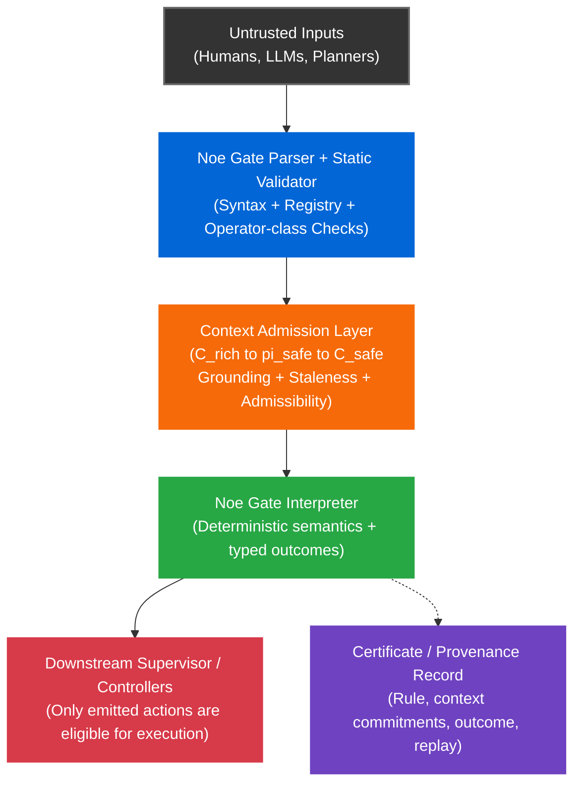

# Noe Gate

**A deterministic action-gating kernel for autonomous systems.**

Noe Gate sits between untrusted proposers - humans, LLMs, planners - and
downstream actuators such as robots and industrial automation. It evaluates
a deterministic decision chain against grounded context and returns one of
three outcomes:

- **`list[action]`** -- permission granted; action emitted
- **`undefined`** -- no action emitted because the guard did not resolve to
  permission
- **`error`** -- strict-mode contract rejection, such as
  `ERR_EPISTEMIC_MISMATCH` or `ERR_CONTEXT_STALE`

Noe Gate is not a control loop or motion planner. It is a fail-stop decision
boundary for discrete, safety-relevant actions, with replayable evidence
records.

**Thesis:** As autonomy stacks increasingly rely on untrusted proposers,
proposal must be separated from permission. In safety-relevant environments,
it is not enough to generate an action. The system must also be able to show
why that action was allowed under grounded context, and reproduce the same
verdict later from the same rule and context.

```
untrusted proposer  -->  Noe Gate  -->  downstream controller
                ↘ certificate / replay record
```

> **Naming note:** **Noe** is the underlying symbolic protocol. **Noe Gate** is the deterministic action-gating runtime built on that protocol. Internal package and module names use the `noe` protocol namespace (`import noe`, `noe/`, `noe-runtime`). Product-facing references use the Noe Gate name.

<br />

## What is in this repository

- Python reference runtime
- Rust core runtime (conformance-matched against Python reference)
- C FFI boundary
- C++20 header-only wrapper
- ROS2 lifecycle adapter
- NIP-011 conformance suite (locked vectors, SHA-256 manifest)
- Grounding reference adapters (LiDAR, camera, epistemic, temporal)
- Certificate persistence, replay, and audit tooling
- BehaviorTree.CPP to Noe Gate migration tool
- Interactive chain evaluator playground

<br />

## What has been validated

This repository now includes a Python reference runtime, a Rust core, language bindings, and a ROS2 adapter.

**Validated:**

- Python reference runtime against the full NIP-011 conformance surface
- Rust core runtime matched against Python reference at 93/93 conformance
  vectors
- C and C++ integration boundaries - smoke tests passing
- ROS2 lifecycle adapter built and run on Ubuntu 22.04.5 ARM64 / ROS2 Humble
- Worked zone-entry scenario:
  - human present -- BLOCKED
  - human absent -- PERMITTED
  - result: `ALL PASS`

**Not yet claimed:**

- production deployment readiness
- broad external replication
- long-running load or soak validation
- wider domain coverage beyond the worked scenarios

<br />

## Quick Start


### ROS2 - validated target path

Built and runtime-validated on Ubuntu 22.04.5 ARM64 / ROS2 Humble. See
[ros2_adapter/README.md](ros2_adapter/README.md) for the exact build
environment, flags, and known limitations before attempting a fresh
installation.

```bash
# 1. Build the Rust core
cd rust/noe_core && cargo build --release
cd ../..

# 2. Build the ROS2 adapter
source /opt/ros/humble/setup.bash
cd ros2_adapter
colcon build --packages-select noe_ros2_adapter

# 3. Run the zone-entry example
source /opt/ros/humble/setup.bash
source install/setup.bash
ros2 launch noe_ros2_adapter mobile_robot_zone_entry.launch.py
```

In a second terminal:

```bash
source /opt/ros/humble/setup.bash
source install/setup.bash
python3 examples/mobile_robot_zone_entry/publish_scenario.py
```

Expected output:

```
Scenario 1 PASS   # human present --> BLOCKED
Scenario 2 PASS   # human absent  --> PERMITTED
Result: ALL PASS
```

<br />

### Python - reference and demo path

**Requirements:** Python 3.11 recommended (3.10 supported), `make`,
macOS / Linux / WSL2.

```bash
git clone https://github.com/noe-protocol/noe-gate.git
cd noe-gate

```bash
python3.11 -m venv .venv
source .venv/bin/activate

python -m pip install --upgrade pip
python -m pip install -e ".[dev]"

make demo              # flagship shipment gate
make integration-demo  # permit / veto / stale / error boundary
make conformance       # locked NIP-011 conformance vectors
make playground        # interactive chain evaluator
```

<br />

### Agent governance - pip install

For LLM tool-use workflows and agentic pipelines:

```bash
pip install noe-runtime
```

```python
import noe  # install: noe-runtime, import: noe

runtime = noe.NoeRuntime()

ctx = runtime.build_context({
    "domain": {"human_approved_broadcast": True},
    "local":  {}
})

chain = "shi @human_approved_broadcast khi sek mek @send_email sek nek"
result = runtime.evaluate(chain, ctx)

if result.get("domain") == "action":
    execute(result["value"])
```

CLIs installed by the package: `noe-replay`, `noe-audit`, `noe-btcpp-convert`.

<br />

### Windows

```bash
# Install WSL2 + Ubuntu, then open an Ubuntu terminal
sudo apt update
sudo apt install -y make git python3.11 python3.11-venv python3-pip

git clone https://github.com/noe-protocol/noe-gate.git
cd noe-gate

python3.11 -m venv .venv
source .venv/bin/activate

python -m pip install ".[dev]"

make conformance
make demo
```

<br />

### Common commands

```bash
make demo              # flagship shipment gate
make demo-full         # full auditor demo suite
make integration-demo  # execution-boundary demo (permit/veto/stale/error)
make guard             # robot guard golden-vector demo (7 ticks)
make conformance       # NIP-011 conformance vectors
make test              # unit tests
make bench             # ROS bridge overhead benchmark
make audit-demo        # chain --> store --> replay --> verify sequence
make playground        # interactive chain evaluator (REPL)
make all               # run everything
make help              # show all available targets
```

<br />

## Contents

1. [Why Noe Gate exists](#why-noe-gate-exists)
2. [Determinism and replay](#determinism-and-replay)
3. [Epistemic admission](#epistemic-admission)
4. [Replayable evidence, not legal verdicts](#replayable-evidence-not-legal-verdicts)
5. [Untrusted proposers](#untrusted-proposers)
6. [Determinism contract](#determinism-contract)
7. [What a certificate looks like](#what-a-certificate-looks-like)
8. [Representative strict-mode error codes](#representative-strict-mode-error-codes)
9. [Operator cheat sheet](#operator-cheat-sheet)
10. [Engineering constraints and trade-offs](#engineering-constraints-and-trade-offs)
11. [Architecture](#architecture)
12. [Implementation status](#implementation-status)
13. [Repository structure](#repository-structure)
14. [Documentation](#documentation)

<br />

## Why Noe Gate exists

Modern autonomy stacks already use rule engines, PLC interlocks, runtime
assurance monitors, behavior-tree guards, and ROS2 supervisor logic. **Noe Gate
does not replace all of these.** Its purpose is narrower.

Noe Gate exists for the case where **untrusted proposers** are allowed to suggest
safety-relevant actions, but those actions must pass through a **small
deterministic enforcement boundary** that is:

- grounded in an explicit admissible context (`C_safe`)
- replayable across conforming runtimes
- capable of distinguishing benign non-permission from contract violation
- able to produce portable evidence records for audit and incident
  reconstruction

In that setting, the central questions are not just "was the action blocked"
but:

- What exact context was admitted into the decision boundary?
- What rule was evaluated?
- Why was the action emitted, withheld, or refused?
- Can another conforming runtime replay the same decision and obtain the same
  normative result?

Noe Gate is designed to make those questions answerable.

| Need | Common baseline | What Noe Gate adds |
|------|-----------------|-------------------|
| Deterministic gating of discrete actions | Rule engines, behavior-tree guards, supervisor code | A bounded decision language with deterministic replay across conforming runtimes |
| Hard real-time plant-floor safety | PLCs, interlocks, low-level safety controllers | Noe Gate does not replace these; it sits upstream of them |
| Supervisory control around advanced autonomy | Runtime assurance architectures, runtime monitors | Explicit guard chains, admissible context projection, and replayable certificates |
| Constraining AI- or planner-generated proposals before actuation | Custom wrappers and application logic | A formal action-admission boundary between proposers and actuators |
| Post-incident reconstruction | Logs, traces, ad hoc telemetry | Frozen context commitments plus typed, replayable decision outcomes |

Noe Gate's claim is not that it is better than all existing safety mechanisms. Its
claim is narrower: **when action proposals come from untrusted or probabilistic
sources, Noe Gate provides a deterministic, replayable, evidence-bearing gate
before execution.**

<br />

## Determinism and replay

Given the same **chain + registry + semantics + `C_safe`**, any conforming
runtime is expected to produce:

- exactly one parse
- exactly one **normative interpretation** under the fixed grammar, registry,
  and semantics
- exactly one evaluation outcome for normative fields

Noe Gate's determinism claim is intentionally narrow: given the same chain,
registry, semantics, and admitted `C_safe`, a conforming runtime must produce
the same normative outcome and canonical commitments. It does not make
sensing, grounding, or physical actuation deterministic.

Noe Gate enforces an **integer-only contract** for normative commitments. Every
`*_hash` input is float-free. Richer upstream context may contain floats, but
sensor and planner adapters must quantize before projection into `C_safe`.

`pi_safe` is the deterministic projection from richer upstream state into the
minimal context the evaluator is allowed to consume. It is responsible for
pruning stale inputs, enforcing admissibility rules, and exposing grounded
predicate membership to the kernel. Debounce, hysteresis, and other
perception-side smoothing belong upstream of `pi_safe`.

<br />

## Epistemic admission

`shi` and `vek` should be read as **runtime-enforced evidentiary status
operators**, not as unrestricted proposer claims. A proposer cannot simply
assert knowledge or belief and have that assertion accepted. The runtime
derives or verifies those memberships from trusted evidence, such as signed
sensor frames or an attested adapter result.

If a chain asserts evidentiary status that is not supported by `C_safe`,
strict mode returns `ERR_EPISTEMIC_MISMATCH`.

`undefined` is a semantic evaluation value. `error` is a contract rejection
emitted by the validator or runtime.

<br />

## Replayable evidence, not legal verdicts

Noe Gate produces a deterministic verdict together with an integrity-protected
record of the rule, admitted context, and outcome. This supports:

- incident reconstruction
- supervisory debugging
- compliance evidence workflows
- fault attribution across perception, adapter, and decision layers

**What Noe Gate provides:**

- **Deterministic evaluation:** identical normative inputs produce identical
  normative outcomes
- **Integrity-protected records:** certificates bind the decision to a
  specific registry and context snapshot
- **Replayability:** a conforming runtime can re-evaluate the same chain
  against the same admitted context

**What Noe Gate does not provide:**

- guarantees that upstream sensing was correct
- guarantees that the downstream supervisor implemented a safe fallback
- legal conclusions about liability or fault on its own

Noe Gate should therefore be understood as **evidence infrastructure for action
admission**, not as a complete legal or safety determination system.

<br />

## Untrusted proposers

LLMs and other planning systems may generate useful proposals, but their
internal reasoning is not itself a deterministic safety contract. Noe Gate treats
those systems as **untrusted proposers**.

A proposer may suggest:

> "Release the pallet."

Noe Gate does not trust that suggestion. It checks whether the action is permitted
under the currently admitted grounded context and the active decision chain.
If the guard does not resolve to permission, the action is not emitted. If the
proposal relies on unsupported evidentiary status, strict mode rejects it with
an explicit error.

This lets probabilistic systems participate in autonomy stacks without giving
them direct authority to trigger safety-relevant actions.

<br />

## Determinism contract

Upstream systems often produce floating-point state. Portable replay across
runtimes is brittle if those values are allowed into canonical hashed
commitments.

For that reason, Noe Gate requires an **integer-only contract** for normative
decision inputs and certificate commitments. Floating-point values may exist
in richer upstream context, but they must be quantized before projection into
`C_safe`.

This is a necessary part of cross-runtime replay portability. It reduces
ambiguity across architectures and languages by excluding float
representations that do not canonicalize reliably.

<br />

## Conformance integrity (NIP-011)

`make conformance` verifies that each test vector is byte-exact against a
locked SHA-256 manifest. An integrity failure means the JSON file on disk does
not match the recorded hash.

If a test vector is intentionally modified, the corresponding hashes must be
updated in both:

- `tests/nip011/nip011_manifest.json`
- `tests/nip011/conformance_pack_v1.0.0.json`

Integrity failures indicate a spec or test change, not a runtime bug, and
must be resolved by updating the manifests and committing them together. The
conformance runner aborts on any mismatch by design.

<br />

## What a certificate looks like

Every decision produces a JSON certificate with hash commitments. Example
(truncated):

```json
{
  "noe_version": "v1.0-rc1",
  "chain": "shi @temperature_ok an shi @human_clear khi sek mek @release_pallet sek nek",
  "registry": {
    "path": "noe/registry.json",
    "hash": "9c2c1e4a8b6d5f2a1d9e3c4b7a6f0e11",
    "commit": "git:3f2a1c9"
  },
  "context_hashes": {
    "root":   "4802862d...4d74",
    "domain": "8d84e2f1...3c90",
    "local":  "f83bb963...7264",
    "safe":   "4b766825...dbbf"
  },
  "outcome": {
    "domain": "list",
    "value": [{
      "type": "action",
      "verb": "mek",
      "target": "@release_pallet",
      "action_hash": "3031cedd...f00b"
    }]
  }
}
```

An auditor can replay the decision by freezing the context, re-evaluating the
chain, and verifying that the hashes match. See
[shipment_certificate_strict.json](examples/auditor_demo/shipment_certificate_strict.json).

Store certificates in an append-only log (`noe/persistence/cert_store.py`).
Auditors verify them by recomputing `context_hashes.safe` and replaying the
chain against `context_snapshot.safe` using `noe_replay verify <cert_file>`.

<br />

## Representative strict-mode error codes

| Code | Meaning | Supervisor action |
|------|---------|-------------------|
| `ERR_CONTEXT_STALE` | Sensor data exceeds staleness threshold | Refresh context, retry |
| `ERR_EPISTEMIC_MISMATCH` | Chain asserts evidentiary status not supported by context | Check sensor pipeline |
| `ERR_ACTION_MISUSE` | Action verb outside guarded block | Fix chain structure |
| `ERR_LITERAL_MISSING` | `@literal` not present in the required context shard | Populate the required shard |
| `ERR_BAD_CONTEXT` | Context is null, array-shaped, or malformed | Fix context construction |
| `ERR_CONTEXT_INCOMPLETE` | Required shard missing | Add missing shard |

Full list: [docs/error_codes.md](docs/error_codes.md)

<br />

## Operator cheat sheet

The following English glosses are display-only reading aids. Canonical Noe chains remain authoritative for parsing and evaluation.

| Operator | Gloss | Role | Example |
|----------|-------|------|---------|
| `shi` | KNOW | Evidentiary status check at the knowledge tier | `shi @door_open` |
| `vek` | BELIEVE | Evidentiary status check at the belief tier | `vek @path_clear` |
| `an` | AND | Conjunction | `shi @a an shi @b` |
| `ur` | OR | Disjunction | `shi @a ur shi @b` |
| `nai` | NOT | Negation | `nai (shi @danger)` |
| `khi` | IF | Guard introducer for conditional action emission | `shi @safe khi sek mek @go sek nek` |
| `sek` | `[` / `]` | Explicit scope boundary | `sek mek @action sek` |
| `nek` | END | Chain terminator | `... sek nek` |
| `mek` | DO | Action emission | `mek @release_pallet` |
| `men` | LOG | Audit / inspection action | `men @safety_check` |

<br />

## Interactive playground

`make playground` launches an interactive chain evaluator. Type a chain, see the
canonical form, gloss, parse tree, and verdict. Modify the context on the fly to
watch evaluation flip.

```
  Noe Gate Playground
  Evaluation mode: strict (real Noe Gate semantics).

Try this:
  shi @path_clear an shi @controller_ready khi sek mek @move_forward sek nek

Then:
  :set @path_clear false

Then run the same chain again and watch it flip from PERMIT to BLOCK.
Same chain, different grounded context, different verdict.

noe [strict]> shi @path_clear an shi @controller_ready khi sek mek @move_forward sek nek

  Canonical:   shi @path_clear an shi @controller_ready khi sek mek @move_forward sek nek
  Gloss    :   KNOW @path_clear AND KNOW @controller_ready IF [ DO @move_forward ] END
  Verdict  :   PERMIT  --> @move_forward
```

Commands: `:examples` `:context` `:set @lit true/false` `:mode strict/partial` `:tree on/off` `:reset` `:help`

<br />

## Engineering constraints and trade-offs

Noe Gate is opinionated. It prioritizes deterministic action admission,
replayability, and evidence quality over maximal flexibility.

### 1. "Modal Logic Theatre" / the threshold critique

**Critique:** "You are redefining knowledge as high confidence."

**Response:** Correct, in a narrow systems sense. Noe Gate does not solve
philosophical truth. It enforces an explicit evidentiary threshold and makes
that threshold inspectable, replayable, and attributable after the fact.

### 2. The latency critique

**Critique:** "This is too slow for tight control loops."

**Response:** Correct. Noe Gate is not a reflex controller. It gates discrete
supervisory decisions - whether a robot may enter a room, whether a pallet
may be released - at 1 to 10 Hz. Tight control loops and reactive safety
functions belong elsewhere in the stack. Noe Gate sits above them.

### 3. Garbage in, signed garbage out

**Critique:** "If the sensor lies, Noe Gate just signs the lie."

**Response:** Correct. Noe Gate does not guarantee perception correctness. What it
provides is a precise record of which admitted inputs led to which decision,
which improves attribution across sensors, adapters, perception models, and
supervisory code.

### 4. Relationship to existing safety patterns

- **PLCs / interlocks:** still the correct mechanism for hard real-time
  plant-floor safety. Noe Gate sits above them, not in place of them.
- **Runtime assurance:** Noe Gate can sit inside a broader runtime assurance
  architecture as a symbolic decision gate.
- **Behavior trees / ROS2 supervisors:** Noe Gate does not replace orchestration;
  it constrains action admission within it.
- **Rule engines:** Noe Gate is narrower, but offers stronger replay and provenance
  commitments.

<br />

## Architecture



<br />

## Implementation status

| Component | Status | Notes |
|-----------|--------|-------|
| Python reference runtime | Stable reference | Normative. All conformance vectors defined here. |
| NIP-011 conformance suite | Locked | SHA-256 manifest. 93 vectors. Aborts on mismatch. |
| Rust core runtime | Implemented | `rust/noe_core/`. Matched against Python reference at 93/93 vectors. One narrow parse-message-format exemption documented. |
| C FFI surface | Implemented | `noe_eval_json` / `noe_free_string` / `noe_version`. Panic-contained. Null and UTF-8 errors return error JSON. |
| C++20 header-only wrapper | Implemented | RAII memory handling. Zero ROS2 dependency. |
| ROS2 lifecycle node adapter | Validated on worked scenario | Built and run on Ubuntu 22.04.5 ARM64 / ROS2 Humble. Correct blocked/permitted output confirmed. See `ros2_adapter/README.md` for scope. |
| Grounding reference adapters | Implemented | `packages/grounding/` - LiDAR zone, camera human-presence, epistemic mapping, temporal utilities. |
| Certificate persistence + replay | Implemented | `noe/persistence/` - append-only JSONL store, tamper detection, replay engine, `noe_replay` CLI. |
| BT.CPP converter | Initial release | `tools/btcpp_converter/` - migration estimator, chain generation, placeholder registry, conversion report. |
| Interactive playground | Implemented | `noe_playground.py` - REPL with parse tree, gloss, context mutation, `make playground`. |
| Domain packs | Not started | Planned for logistics and healthcare verticals. |

**Portability contract:** any conforming runtime must match parse and
evaluation outcomes for all NIP-011 vectors and certificate and hash
commitments for normative fields. Start with `tests/nip011/` and treat the
conformance manifest as the source of truth.

<br />

## Repository structure

```text
noe/                       # Python reference runtime + persistence layer
  persistence/             # cert_store.py, replay.py, audit.py
  glossary.json            # operator gloss mappings (display only)
  gloss.py                 # read-only gloss renderer
rust/
  noe_core/                # Rust core runtime (conformance-matched)
ros2_adapter/              # ROS2 lifecycle node, C FFI surface, C++20 wrapper
  include/noe/             # noe_core.h, noe.hpp
  src/                     # noe_gate_node.cpp
  examples/                # mobile_robot_zone_entry/
packages/
  grounding/               # LiDAR zone, camera human-presence, epistemic,
                           # temporal reference adapters
  btcpp_converter/         # BehaviorTree.CPP to Noe Gate chain migration tool
tests/                     # Unit tests + NIP-011 conformance vectors
examples/                  # End-to-end demos (auditor, robot guard,
                           # integration demo)
nips/                      # Specification documents
docs/                      # Integration guides, error codes, threat model
noe_playground.py          # Interactive chain evaluator
```

<br />

## Documentation

- [LLM / agent governance quickstart](docs/quickstart_llm_governance.md)
- [ROS2 adapter](ros2_adapter/README.md) - build instructions, validation
  environment, honest scope statement
- [Measured execution boundary demo](docs/execution_boundary_demo.md)
- [ROS2 integration pattern](docs/ros2_integration_example.md)
- [NIP-011 conformance](tests/nip011/README.md) - normative vectors and
  manifest
- [Error codes](docs/error_codes.md)
- [Threat model](THREAT_MODEL.md)

<br />

## License

Apache 2.0. See [LICENSE](LICENSE).

<br />

## Contact

- Issues: [github.com/noe-protocol/noe-gate/issues](https://github.com/noe-protocol/noe-gate/issues)
- Discussions: [github.com/noe-protocol/noe-gate/discussions](https://github.com/noe-protocol/noe-gate/discussions)
