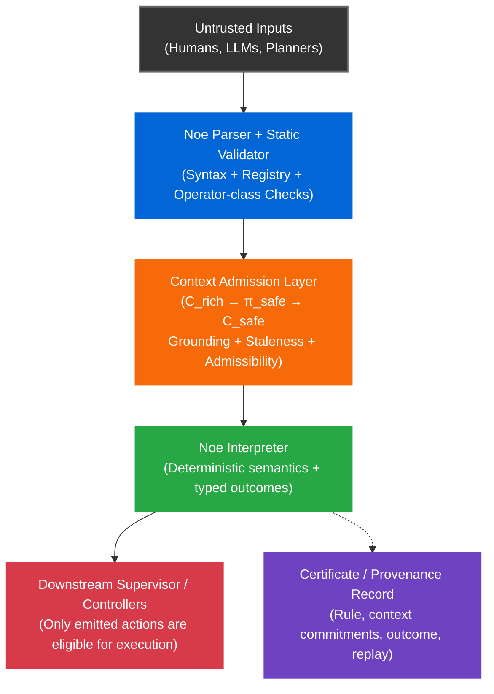

# Noe

**A deterministic action-gating kernel for autonomous systems.**

**Thesis:** As autonomy stacks increasingly rely on untrusted proposers such as LLMs, planners, and learned components, it becomes critical to separate proposal from permission. In safety-relevant environments, it is not enough to generate an action; the system must also be able to show why that action was admissible under grounded context and replay the same decision later under the same rule and commitments. Noe is a deterministic action-admission kernel designed for that purpose.

Noe is an **enforcement boundary** between **untrusted proposers** such as humans, LLMs, and planners, and **critical actuators** such as robots and industrial automation. A proposer suggests an action. Noe evaluates a small deterministic decision chain against a frozen, grounded context (`C_safe`) and returns one of three outcomes:

- **`list[action]`** → permitted; action proposal emitted
- **`undefined`** → no action emitted because the guard did not resolve to permission
- **`error`** → strict-mode contract rejection, such as `ERR_EPISTEMIC_MISMATCH` or `ERR_CONTEXT_STALE` (refusal; reason recorded in the certificate when provenance is enabled)

Only an emitted action is eligible for downstream execution. Both **`undefined`** and **`error`** are **non-execution outcomes**, but they are intentionally distinct in the provenance record. `undefined` is an expected semantic fall-through. `error` indicates a violated safety contract and should be surfaced to supervision.

**Scope:** Noe gates **discrete, safety-relevant decisions**. It is **not** a control loop, motion planner, or recovery system. A downstream supervisor or reflex layer remains responsible for fallback behavior such as hold, slow, or stop. Noe is fail-stop by design: it prevents unauthorized actions from being emitted. Liveness, retry, and recovery are handled elsewhere in the stack.

<br />

## Quick Start

**Requirements**

- Python 3.11 recommended (3.10 supported)
- macOS, Linux, or Windows (via WSL2 recommended)
- `make` installed
- On Windows, use WSL2 for a Linux-native development environment

Start with `make demo` for the flagship shipment gate demo.  

Run `make demo-full` for the broader auditor walkthrough.

If you already have the repo locally, skip the `git clone` step and just `cd` into `noe`.

<br />

```bash
git clone https://github.com/noe-protocol/noe.git || true
cd noe

python3.11 -m venv .venv
source .venv/bin/activate

python -m pip install --upgrade pip
python -m pip install ".[dev]"

make demo
make conformance
```
<br />

### Run the conformance suite
Executes the locked NIP-011 conformance vectors.

```bash
make conformance
```
<br />

### Run the full suite
Runs the full verification path: unit tests, conformance, demos, and benchmark.

```bash
make all
```
<br />

### Optional: run the full demo set
Runs the broader auditor demo set, including epistemic, hallucination, and multi-agent scenarios.

```bash
make demo-full
```
<br />

### Windows (recommended): WSL2 / Ubuntu

```bash
# 1) Install WSL2 + Ubuntu, then open an Ubuntu terminal
# 2) Install build tools
sudo apt update
sudo apt install -y make git python3.11 python3.11-venv python3-pip

git clone https://github.com/noe-protocol/noe.git
cd noe

python3.11 -m venv .venv
source .venv/bin/activate

python -m pip install --upgrade pip
python -m pip install ".[dev]"

make conformance
make demo
make all
```

For development workflows, replace:

```bash
python -m pip install ".[dev]"
```

with:

```bash
python -m pip install -e ".[dev]"
```

<br />

### One-minute example

```
shi @human_present khi sek mek @stop sek nek
```

- `shi` = evidentiary status check at the knowledge tier
- `khi` = guard (if ... then)
- `sek` = explicit scope boundary for guarded action blocks
- `mek` = action verb
- `nek` = chain terminator

Identifiers such as `@human_present` and `@stop` are registry keys. See `noe/registry.json` for identifier kinds and types.

Illustrative example only: sources and thresholds live in the active Domain Pack; the core registry fixes identifier kinds and types.

Important: `shi @human_present` must be grounded from attested sensor evidence or a trusted adapter result. Proposer-supplied claims do not satisfy `shi` or `vek`.

```json
{
  "@human_present":  { "kind": "literal", "shard": "modal.knowledge", "source": "vision.person_bbox", "threshold": 0.90 },
  "@e_stop_pressed": { "kind": "literal", "shard": "modal.knowledge", "source": "hw.estop" },
  "@stop":           { "kind": "action",  "verb": "mek", "action_class": "safety_stop" }
}
```

- If `@human_present` is grounded true in `C_safe.modal.knowledge` → emits `mek @stop`
- If grounded false → `undefined`
- If missing or ungrounded in strict mode → error: `ERR_EPISTEMIC_MISMATCH`

<br />

### One-minute example (compound)

```
shi @human_present ur shi @e_stop_pressed khi sek mek @stop sek nek
```

- `ur` = disjunction (OR)
- If either `shi @human_present` or `shi @e_stop_pressed` is grounded true in `C_safe` → emits `mek @stop`
- If both are grounded false → `undefined`
- If a required predicate is missing or ungrounded in strict mode → error

Propagation rules for `ur` over `undefined` are normative in NIP-005.

[Full Auditor Demo Walkthrough](examples/auditor_demo/README.md)

<br />

### Common Commands

```bash
make demo          # Flagship shipment demo
make demo-full     # Full auditor demo suite
make guard         # Robot guard golden-vector demo (7 ticks)
make conformance   # NIP-011 conformance vectors
make test          # Unit tests
make bench         # ROS bridge overhead benchmark
make all           # Run everything
make help          # Show all available targets
```

In practice: planners and LLMs propose → Noe gates → ROS2/controllers execute.

<br />

## **Contents**
1. [Why Noe exists](#why-noe-exists)
2. [Determinism and replay](#determinism-and-replay)
3. [Epistemic admission](#epistemic-admission)
4. [Replayable evidence, not legal verdicts](#replayable-evidence-not-legal-verdicts)
5. [Untrusted proposers](#untrusted-proposers)
6. [Determinism contract](#determinism-contract)
7. [What a certificate looks like](#what-a-certificate-looks-like)
8. [Representative strict-mode error codes](#representative-strict-mode-error-codes)
9. [Operator cheat sheet](#operator-cheat-sheet)
10. [Engineering constraints and trade-offs](#engineering-constraints-and-trade-offs)
11. [Architecture](#architecture)
12. [Implementation status](#implementation-status)
13. [Repository structure](#repository-structure)
14. [Documentation](#documentation)

<br />

## Why Noe exists

Modern autonomy stacks already use rule engines, PLC interlocks, runtime assurance monitors, behavior-tree guards, and ROS2 supervisor logic. **Noe does not replace all of these.** Its purpose is narrower.

Noe exists for the case where **untrusted proposers** are allowed to suggest safety-relevant actions, but those actions must pass through a **small deterministic enforcement boundary** that is:

- grounded in an explicit admissible context (`C_safe`)
- replayable across conforming runtimes
- capable of distinguishing benign non-permission from contract violation
- able to produce portable evidence records for audit and incident reconstruction

In that setting, the central questions are not just:

- Was the action blocked?
- What exact context was admitted into the decision boundary?
- What rule was evaluated?
- Why was the action emitted, withheld, or refused?
- Can another conforming runtime replay the same decision and obtain the same normative result?

Noe is designed to make those questions answerable.
<br />

| Need | Common baseline | What Noe adds |
|------|-----------------|---------------|
| Deterministic gating of discrete actions | Rule engines, behavior-tree guards, supervisor code | A bounded decision language with deterministic replay across conforming runtimes |
| Hard real-time plant-floor safety | PLCs, interlocks, low-level safety controllers | Noe does not replace these; it sits upstream of them |
| Supervisory control around advanced autonomy | Runtime assurance architectures, runtime monitors | Explicit guard chains, admissible context projection, and replayable certificates |
| Constraining AI- or planner-generated proposals before actuation | Custom wrappers and application logic | A formal action-admission boundary between proposers and actuators |
| Post-incident reconstruction | Logs, traces, ad hoc telemetry | Frozen context commitments plus typed, replayable decision outcomes |

Noe's claim is not that it is better than all existing safety mechanisms. Its claim is narrower: **when action proposals come from untrusted or probabilistic sources, Noe provides a deterministic, replayable, evidence-bearing gate before execution.**

<br />

## Determinism and replay

Given the same **chain + registry + semantics + `C_safe`**, any conforming runtime is expected to produce:

- exactly one parse
- exactly one **normative interpretation** under the fixed grammar, registry, and semantics
- exactly one evaluation outcome for normative fields

Noe’s determinism claim is intentionally narrow. It applies only to the normative replay boundary: given the same chain, registry, semantics, and admitted C_safe, a conforming runtime must produce the same normative outcome and the same canonical commitments for normative fields. It does not claim to make upstream sensing, grounding, or physical actuation deterministic.

Noe enforces an **integer-only contract** for normative commitments. Every `*_hash` input is float-free. Richer upstream context may contain floats, but sensor and planner adapters must quantize before projection into `C_safe`.

`π_safe` is the deterministic projection from richer upstream state into the minimal context the evaluator is allowed to consume. In practice, `π_safe` is the policy-controlled admission layer that converts richer upstream state into the minimal, canonical, admissible context consumed by Noe. It is responsible for pruning stale inputs, enforcing admissibility rules, and exposing grounded predicate membership to the kernel. Debounce, hysteresis, and other perception-side smoothing belong upstream of `π_safe`.
<br />

## Epistemic admission

`shi` and `vek` should be read as **runtime-enforced evidentiary status operators**, not as unrestricted proposer claims. A proposer cannot simply assert knowledge or belief and have that assertion accepted. The runtime derives or verifies those memberships from trusted evidence, such as signed sensor frames or an attested adapter result.

If a chain asserts evidentiary status that is not supported by `C_safe`, strict mode returns `ERR_EPISTEMIC_MISMATCH`.

`undefined` is a semantic evaluation value. `error` is a contract rejection emitted by the validator or runtime.

<br />

## Replayable evidence, not legal verdicts

Noe produces a deterministic verdict together with an integrity-protected record of the rule, context commitments, and outcome. This supports:

- incident reconstruction
- supervisory debugging
- compliance evidence workflows
- fault attribution across perception, adapter, and decision layers

**What Noe provides:**

- **Deterministic evaluation:** identical normative inputs produce identical normative outcomes
- **Integrity-protected records:** certificates bind the decision to a specific registry and context snapshot
- **Replayability:** a conforming runtime can re-evaluate the same chain against the same admitted context

**What Noe does not provide:**

- guarantees that upstream sensing was correct
- guarantees that the downstream supervisor implemented a safe fallback
- legal conclusions about liability or fault on its own

Noe should therefore be understood as **evidence infrastructure for action admission**, not as a complete legal or safety determination system.

<br />

## Untrusted proposers

LLMs and other planning systems may generate useful proposals, but their internal reasoning is not itself a deterministic safety contract. Noe treats those systems as **untrusted proposers**.

A proposer may suggest:

> "Release the pallet."

Noe does not trust that suggestion. It checks whether the action is permitted under the currently admitted grounded context and the active decision chain. If the guard does not resolve to permission, the action is not emitted. If the proposal relies on unsupported evidentiary status, strict mode rejects it with an explicit error.

This lets probabilistic systems participate in autonomy stacks without giving them direct authority to trigger safety-relevant actions.

<br />

## Determinism contract

Upstream systems often produce floating-point state. Portable replay across runtimes is brittle if those values are allowed into canonical hashed commitments.

For that reason, Noe requires an **integer-only contract** for normative decision inputs and certificate commitments. Floating-point values may exist in richer upstream context, but they must be quantized before projection into `C_safe`.

This is a necessary part of cross-runtime replay portability. It reduces ambiguity across architectures and languages by excluding float representations that do not canonicalize reliably.

<br />

## Conformance Integrity Notes (NIP-011)

`make conformance` verifies that each test vector is byte-exact against a locked SHA-256 manifest. An integrity failure means the JSON file on disk does not match the recorded hash.

If a test vector is intentionally modified, the corresponding hashes must be updated in both:
- `tests/nip011/nip011_manifest.json`
- `tests/nip011/conformance_pack_v1.0.0.json`

Integrity failures indicate a spec or test change, not a runtime bug, and must be resolved by updating the manifests and committing them together.

The conformance runner aborts on any mismatch by design.

<br />

## What a certificate looks like

Every decision produces a JSON certificate with hash commitments. Example (truncated):

```json
{
  "noe_version": "v1.0-rc1",
  "chain": "shi @temperature_ok an shi @human_clear khi sek mek @release_pallet sek nek",
  "registry": {
    "path": "noe/registry.json",
    "hash": "9c2c1e4a8b6d5f2a1d9e3c4b7a6f0e11",
    "commit": "git:3f2a1c9"
  },
  "context_hashes": {
    "root":   "4802862d...4d74",
    "domain": "8d84e2f1...3c90",
    "local":  "f83bb963...7264",
    "safe":   "4b766825...dbbf"
  },
  "outcome": {
    "domain": "list",
    "value": [{
      "type": "action",
      "verb": "mek",
      "target": "@release_pallet",
      "action_hash": "3031cedd...f00b"
    }]
  }
}
```

An auditor can replay the decision by freezing the context, re-evaluating the chain, and verifying that the hashes match. See a full example at [shipment_certificate_strict.json](examples/auditor_demo/shipment_certificate_strict.json)

Store certificates in an append-only log. Auditors verify them by recomputing `context_hashes.safe` and replaying the chain against `context_snapshot.safe`.

Certificates explicitly bind the runtime's registry by hash, and optionally by source commit, so auditors replay against the exact identifier-to-type mapping used at decision time. This prevents cross-agent ambiguity when the same symbolic identifiers exist in multiple registries. Certificates may also bind evidence provenance, such as a sensor-frame hash or adapter attestation hash, so auditors can verify that epistemic grounding was derived from attested inputs rather than proposer claims.

<br />

## Representative strict-mode error codes

| Code | Meaning | Supervisor action |
|------|---------|-------------------|
| `ERR_CONTEXT_STALE` | Sensor data exceeds staleness threshold | Refresh context, retry |
| `ERR_EPISTEMIC_MISMATCH` | Chain asserts evidentiary status not supported by context | Check sensor pipeline |
| `ERR_ACTION_MISUSE` | Action verb outside guarded block | Fix chain structure |
| `ERR_LITERAL_MISSING` | `@literal` not present in the required context shard | Populate the required shard |
| `ERR_BAD_CONTEXT` | Context is null, array-shaped, or malformed | Fix context construction |
| `ERR_CONTEXT_INCOMPLETE` | Required shard missing | Add missing shard |

Full list: [docs/error_codes.md](docs/error_codes.md)

<br />

## Operator cheat sheet

| Operator | Role | Example |
|----------|------|---------|
| `shi` | Evidentiary status check at the knowledge tier | `shi @door_open` |
| `vek` | Evidentiary status check at the belief tier | `vek @path_clear` |
| `an` | Conjunction (AND) | `shi @a an shi @b` |
| `ur` | Disjunction (OR) | `shi @a ur shi @b` |
| `nai` | Negation (NOT) | `nai (shi @danger)` |
| `khi` | Guard (if ... then) | `shi @safe khi sek mek @go sek nek` |
| `sek` | Explicit scope boundary | `sek mek @action sek` |
| `nek` | Chain terminator | `... sek nek` |
| `mek` | Action emission | `mek @release_pallet` |
| `men` | Audit/log action | `men @safety_check` |

<br />

## Engineering constraints and trade-offs

Noe is opinionated. It prioritizes deterministic action admission, replayability, and evidence quality over maximal flexibility.

### 1. "Modal Logic Theatre" / the threshold critique

**Critique:** "You are redefining knowledge as high confidence."

**Response:** Correct, in a narrow systems sense. Noe does not solve philosophical truth. It enforces an explicit evidentiary threshold and makes that threshold inspectable, replayable, and attributable after the fact.

### 2. The latency critique

**Critique:** "This is too slow for tight control loops."

**Response:** Correct. Noe is not a reflex controller. It is meant to gate discrete supervisory decisions, such as whether a robot may enter a room or release a pallet. Tight control loops belong elsewhere in the stack.

### 3. Garbage in, signed garbage out

**Critique:** "If the sensor lies, Noe just signs the lie."

**Response:** Correct. Noe does not guarantee perception correctness. What it does provide is a precise record of which admitted inputs led to which decision, which improves attribution across sensors, adapters, perception models, and supervisory code.

### 4. Relationship to existing safety patterns
- **PLCs / interlocks:** still the correct mechanism for hard real-time plant-floor safety
- **Runtime assurance:** Noe can sit inside a broader runtime assurance architecture as a symbolic decision gate
- **Behavior trees / ROS2 supervisors:** Noe does not replace orchestration; it constrains action admission within it
- **Rule engines:** Noe is narrower, but offers stronger replay and provenance commitments

<br />

## Architecture



<br />

## Implementation status

This repository contains the Python reference implementation, which functions as an executable specification optimized for semantic clarity, testability, and spec conformance.
- **Reference implementation:** Python 3.11+
- **Conformance:** NIP-011 vectors are normative
- **Portability contract:** any compliant runtime in Rust, C++, Zig, or another language must match:
  - parse and evaluation outcomes for all NIP-011 vectors
  - certificate and hash commitments for normative fields

The proposer is not trusted. The runtime, registry, and context-admission path together define the trusted decision boundary.

Planned porting targets:
- Rust core runtime for high-assurance portable embedding
- C++20 runtime / header-only adapter layer for ROS 2 and industrial integration

If you are implementing a new runtime, start with `tests/nip011/` and treat the conformance manifest as the source of truth.

<br />

## Repository structure

```text
noe/                    # Core runtime (parser, validator, context admission, interpreter)
tests/                  # Unit tests + NIP-011 conformance vectors
examples/               # End-to-end demos (auditor, robot guard)
nips/                   # Specification documents (NIP-005, NIP-009, NIP-010, NIP-011)
```

<br />

## Documentation
- [NIP-011: Conformance](tests/nip011/README.md) - normative vectors and manifest
- [ROS 2 Integration Pattern](docs/ros2_integration_example.md) - integration guide
- [Canonicalization Tests](tests/test_context_canonicalization.py) - order-invariant hashing coverage
- [Error Codes](docs/error_codes.md) - strict-mode failure semantics
- [Threat Model](THREAT_MODEL.md) - trust boundaries, adversary assumptions, and limits

<br />

## License

Apache 2.0. See [LICENSE](LICENSE).

<br />

## Contact
- Issues: [github.com/noe-protocol/noe/issues](https://github.com/noe-protocol/noe/issues)
- Discussions: [github.com/noe-protocol/noe/discussions](https://github.com/noe-protocol/noe/discussions)
